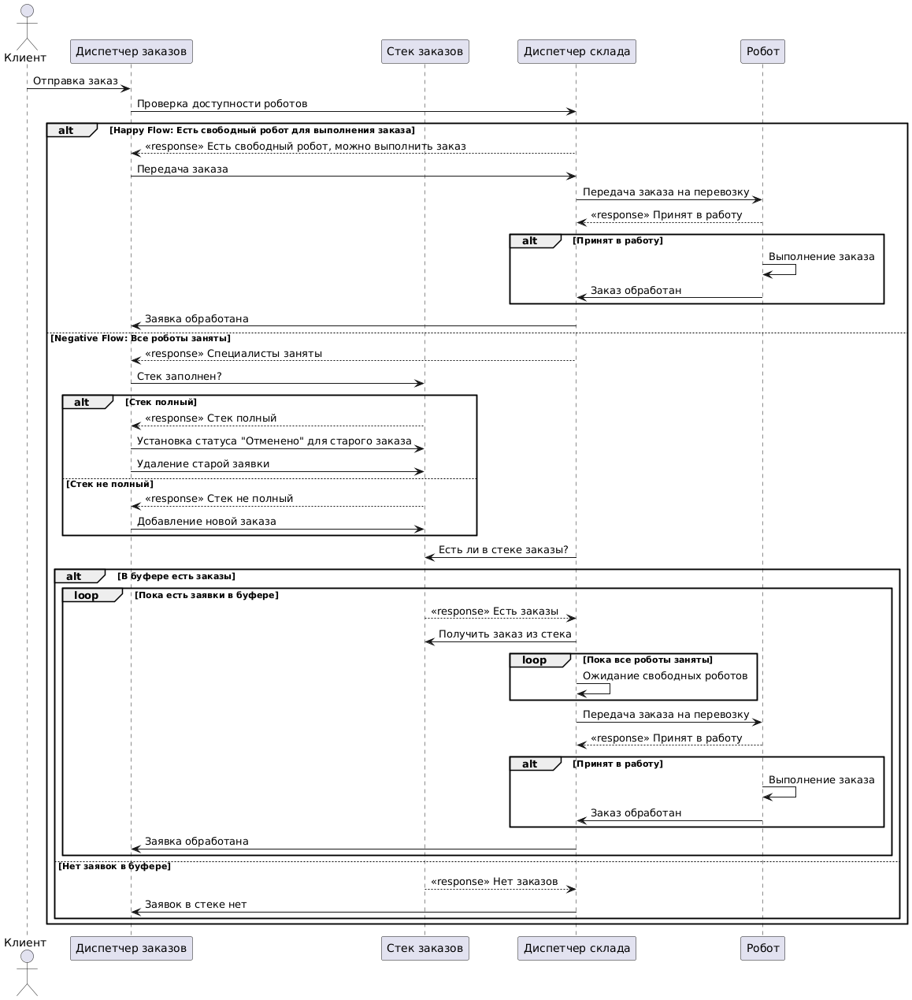

# Маппинг #

## Описание ##

Система обработки заявок в автоматизированной системе хранения и выдачи товаров на складе с роботизированными
устройствами для перемещения грузов

1. Источник — (заказчик) заказчик, создающий запрос на перемещение товара на складе.
2. Заявка — запрос на перемещение товара из одной зоны склада в другую.
3. Диспетчер постановки — (диспетчер заказов) система управления очередью, которая заполняет очередь. В случае
   переполнения очереди удаляет самую старую заявку, выдавая ей статус «Отменено».
4. Буфер — (стек заказов) виртуальная очередь заявок на перемещение товаров (LIFO — последняя заявка обрабатывается
   первой).
5. Диспетчер выборки — (диспетчер склада) система, выбирающая заявки для роботов (по кольцу), чтобы распределять
   нагрузку равномерно между ними.
6. Прибор — (робот) роботизированный манипулятор, перемещающий товар (время обработки заявки распределено по
   экспоненциальному закону).

## Особенности реализации ## 

1. Распределение заявок: распределяет заявки по роботам по кольцевому принципу, отслеживает их состояние.
2. Буфер: хранит заявки, использует LIFO. При переполнении удаляет старые заявки.
3. Планирование роботов: распределяет заявки между освобождающимися роботами, следит за балансом нагрузки.
4. Управление роботами: заказы на исполнение назначаются роботам из диспетчера, роботы немедленно приступают к
   выполнению.
5. Реализация в рамках курсовой работы будет монолитной

## Вариант 16 ## 

ИБ ИЗ2 ПЗ1 Д10З1 Д10О3 Д2П2 Д2Б2 ОР1 ОД1

1. ИБ — бесконечный источник заявок.
2. ИЗ2 — равномерный закон генерации заявок.
3. ПЗ1 — экспоненциальный закон обслуживания заявок.
4. Д10З1 — заполнение буфера по кольцу.
5. Д10О3 — самая старая заявка в буфере получает отказ в случае переполнения.
6. Д2П2 — выбор прибора для обслуживания по кольцу.
7. Д2Б2 — выбор заявки на обслуживание по принципу LIFO (последний пришел — первый обслужен).
8. ОР1 — сводная таблица результатов работы программы.
9. ОД1 — отображение работы модели в виде календаря событий, буфера и текущего состояния.

## Диаграмма классов ##

1. Класс **Client**  
   **Описание:** Класс, описывающий клиента, создающего заказы  
   **Приватные поля класса:**  
    * **_orders: list[Order]** - массив текущих заказов клиента  

   **Публичные методы:**  
    * **generate_order(): void** - метод, создающий рандомный заказ на перемещение
        
2. Класс **Order**  
   **Описание:** Класс, описывающий заказ на перемещение  
   **Приватные поля класса:**  
    * **_id: uint** - уникальный идентификатор заказа
    * **_from: uint** - идентификатор места, откуда нужно переместить
    * **_to: uint** - идентификатор места, куда нужно переместить
    * **_status: ExecutionStatus** - текущий статус заказа

   **Публичные методы:**  
    * **Order(from: uint, to: uint)** - конструктор класса с двумя полями: откуда и куда положить
    * **set_status(new_status: ExecutionStatus): void** - установить новый статус для заказа
    * **get_status(): ExecutionStatus** - получить текущий статус
    * **get_id(): uint** - получить идентификатор заказа
        
3. Класс **OrderManager**  
   **Описание:** Диспетчер заказов, управляет очередью  
   **Приватные поля класса:**  
    * **_order_stack: OrderStack** - стек, в котором хранятся заказы

   **Публичные методы:**  
    * **add_order(order: Order): void** - добавляет заказ в очередь
    * **failed_order(order: Order): void** - устанавливает статус **"Не выполнен"** для заказа и удаляет его из очереди
    * **done_order(order: Order): void** - устанавливает статус **"Выполнен"** для заказа и удаляет его из очереди
        
4. Класс **OrderStack**  
   **Описание:** Стек в котором хранятся все заказы  
   **Приватные поля класса:**  
    * **_stack: list[Order]** - стек, в которой лежат все заказы
    * **_count: uint** - размер стека

   **Публичные методы:**  
    * **get_length(): uint** - возвращает длину стека
    * **add_order(order: Order): void** - добавляет заказ в начало стека
    * **set_status(order: Order, status: ExecutionStatus): void** - устанавливает статус для заказа
    * **get_first(): Order** - возвращает последний добавленный заказ
    * **remove_first(): void** - удаляет последний добавленный заказ
        
5. Класс **WarehouseManager**  
   **Описание:** Менеджер склада, управляет роботами и назначает им заказы  
   **Приватные поля класса:**  
    * **_robots: [Robot]** - список роботов
    * **_current_order: Order** - текущий заказ, который требуется обработать

   **Публичные методы:**  
    * **available_robots(): bool** - проверка доступных роботов
    * **add_order(order: Order): void** - добавить заказ
    * **set_status(order: Order, status: ExecutionStatus): void** - установить статус для заказа
        
6. Класс **Robot**  
   **Описание:** Робот, выполняющий заказ  
   **Приватные поля класса:**  
    * **_current_order: Order** - текущий заказ, выполняемый роботом
    * **_work_now: bool** - работает ли сейчас робот

   **Публичные методы:**  
    * **set_order(order: Order): void** - установить заказ для выполнения
    * **start_order(): void** - начать выполнение заказа
    * **available(): bool** - доступен ли для выполнения заказов

## BPMN ##

## Блок схема ##

## Сиквенсы ##

